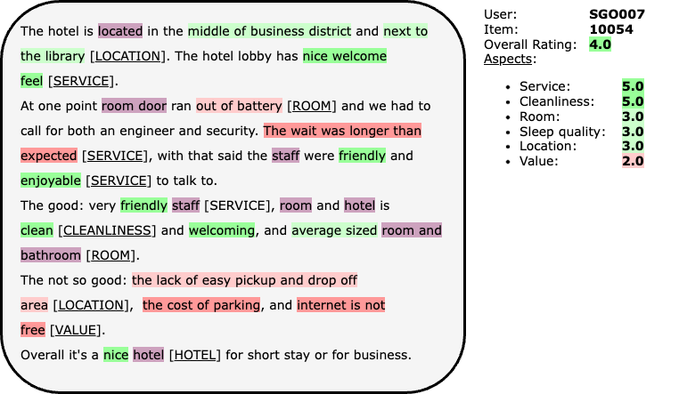
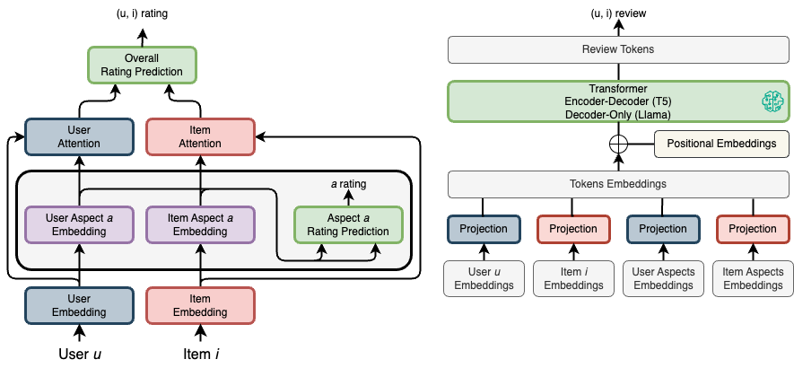
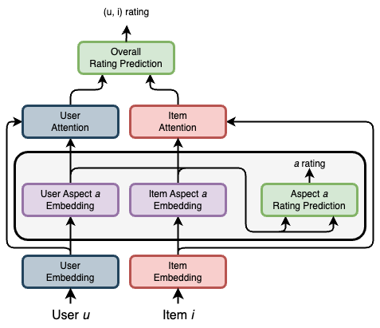
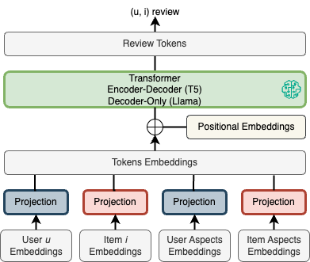
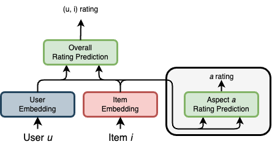

# AURA: Aspect-based Unified Ratings Prediction and Personalized Review Generation with Attention

## Introduction

**Figure 1: Example of a multi-aspect review from the TripAdvisor hotel dataset.** 

## Model

**Figure 2: AURA Overview.** Rating module (left) Review module (right).
Illustration of the AURA model (Aspect-based Unified Ratings Prediction and Personalized Review Generation with Attention). AURA combines unified prediction of overall ratings and ratings for specific aspects, as well as personalized review generation. On the left, the ratings prediction module is based on user and item embeddings, with attention to specific aspects to provide overall and aspects ratings. On the right, the review generation module relies on a transformer (T5 or Llama) to integrate user, item and aspects embeddings, enabling contextualized and personalized review generation.

**Figure 3: AURA Rating module.**

**Figure 4: AURA Review module.**

## Experiments
### Datasets

| Datasets             | # Aspects | # Users | # Items | # Interactions |
| -------------------- | --------- | ------- | ------- | -------------- |
| Hotels (TripAdvisor) | 6         | 716 870 | 10 008  | 1.4M           |
|                      |           | 8 830   | 2 903   | 62.7K          |
| Beer (RateBeer)      | 4         | 28 257  | 109 560 | 2.7M           |
|                      |           | 8 384   | 5 093   | 201.7K         |
### Baselines

| Model                                                                                        | Implem.                                                                             | Task          | Rating | Review | Aspect |
| -------------------------------------------------------------------------------------------- | ----------------------------------------------------------------------------------- | ------------- | ------ | ------ | ------ |
| *Rating only*                                                                                | ============                                                                        | ===========   | =====  | ====== | ====== |
| [MF](https://www.cs.columbia.edu/~blei/fogm/2023F/readings/KorenBellVolinsky2009.pdf) (2009) | [Link](https://github.com/PreferredAI/cornac/tree/master/cornac/models/mf)          | Rating        | ✅      | ❌      | ❌      |
| [MLP](https://arxiv.org/pdf/1708.05031) (2017)                                               | Implem. [Link](https://github.com/PreferredAI/cornac/blob/master/cornac/models/ncf) | Rating        | ✅      | ❌      | ❌      |
| [NeuMF](https://arxiv.org/pdf/1708.05031) (2017)                                             | Implem. [Link](https://github.com/PreferredAI/cornac/tree/master/cornac/models/ncf) | Rating        | ✅      | ❌      | ❌      |
| *Aspect modeling*                                                                            | ============                                                                        | ===========   | =====  | ====== | ====== |
| [A3NCF](https://www.ijcai.org/proceedings/2018/0521.pdf) (2018)                              | [Link](https://github.com/hustlingchen/A3NCF/tree/master)                           | Rating        | ✅      | ✅      | ✅      |
| [ALFM](https://dl.acm.org/doi/pdf/10.1145/3178876.3186145) (2018)                            | Implem.                                                                             | Rating        | ✅      | ✅      | ✅      |
| [ANR](https://raihanjoty.github.io/papers/chin-et-al-cikm-18.pdf) (2018)                     | [Link](https://github.com/almightyGOSU/ANR)                                         | Rating        | ✅      | ✅      | ✅      |
| *Review generation*                                                                          | ============                                                                        | ===========   | =====  | ====== | ====== |
| [Att2Seq](https://aclanthology.org/E17-1059.pdf) (2017) (RNN)                                | [Link](https://github.com/lileipisces/Att2Seq)                                      | Review        | ❌      | ✅      | ❌      |
| [ACMLM](https://aclanthology.org/D19-1018.pdf) (2019) (RNN)                                  | [Link](https://github.com/nijianmo/recsys_justification)                            | Review        | ❌      | ✅      | ✅      |
| *Multi-task*                                                                                 | ============                                                                        | ===========   | =====  | ====== | ====== |
| [NRT](https://arxiv.org/pdf/1708.00154) (2017) (RNN)                                         | [Link](https://github.com/lileipisces/NRT)                                          | Rating+Review | ✅      | ✅      | ❌      |
| [PETER](https://arxiv.org/pdf/2105.11601) (2021) (Transformer)                               | [Link](https://github.com/lileipisces/PETER)                                        | Rating+Review | ✅      | ✅      | ❌      |
| [PETER+](https://arxiv.org/pdf/2105.11601) (2021) (Transformer)                              | [Link](https://github.com/lileipisces/PETER)                                        | Rating+Review | ✅      | ✅      | ❌      |
| [PEPLER](https://dl.acm.org/doi/pdf/10.1145/3580488) (2023) (Transformer)                    | [Link](https://github.com/lileipisces/PEPLER/tree/master)                           | Rating+Review | ✅      | ✅      | ❌      |
##### Multi-Aspects MLP (Ours)

**Figure 5: Multi-Aspects Rating prediction module.** Without aspects modeling.

##### ANR + Aspects Loss
- [ANR](https://raihanjoty.github.io/papers/chin-et-al-cikm-18.pdf) (2018)
- ANR doesn't use real aspect ratings (like all other baselines with aspect modeling)
- **Our ANR extension:** use annotated aspects and add loss on these aspects

##### AURA versions

| Model                          | Attn |          |            | **Aspects Shared** |            | Skip conn. |
| ------------------------------ | ---- | -------- | ---------- | ------------------ | ---------- | ---------- |
|                                |      | **Type** | **Shared** | **Emb.**           | **Rating** |            |
| **AURA**                       | ✅    | SELF     | ❌          | ❌                  | ❌          | ❌          |
| AURA shared_self_attention     | ✅    | SELF     | ✅          | ❌                  | ❌          | ❌          |
| AURA notshared_cross_attention | ✅    | CROSS    | ❌          | ❌                  | ❌          | ❌          |
| AURA shared_cross_attention    | ✅    | CROSS    | ✅          | ❌                  | ❌          | ❌          |
| AURA shared_aspects_embeddings | ✅    | SELF     | ❌          | ✅                  | ❌          | ❌          |
| AURA shared_aspects_ratings    | ✅    | SELF     | ❌          | ❌                  | ✅          | ❌          |
| AURA skip_connection           | ✅    | SELF     | ❌          | ❌                  | ❌          | ✅          |
| AURA pooling (Max pooling)     | ❌    | N/A      | N/A        | ❌                  | ❌          | ❌          |

#### Setup
##### Rating prediction models

| MF (2009)  |           |
| ---------- | --------- |
| **Param**  | **Value** |
| dimension  | 128       |
| lr         | 0.001     |
| lambda reg | 0.001     |
| epochs     | 50        |
| batch      | 256       |

| MLP (2017) |                 |
| ---------- | --------------- |
| **Param**  | **Value**       |
| dimension  | 128             |
| layers     | [256 128 64 32] |
| activation | ReLU            |
| lr         | 0.001           |
| optim      | Adam            |
| epochs     | 50              |
| batch      | 256             |

| NCF (2017)   |                 |
| ------------ | --------------- |
| **Param**    | **Value**       |
| mf dimension | 32              |
| mlps layers  | [256 128 64 32] |
| activation   | ReLU            |
| lr           | 0.001           |
| optim        | Adam            |
| epochs       | 50              |
| batch        | 256             |

| A3NCF (2018)             |           |
| ------------------------ | --------- |
| **Param**                | **Value** |
| number of latent factors | 128       |
| vocabulary size          | 10 000    |
| gibbs sampling itaration | 100       |
| eta                      | (1, 1)    |
| lr                       | 0.001     |
| dropout                  | 0.5       |
| optim                    | SGD       |
| epochs                   | 50        |
| batch                    | 512       |

| ALFM (2018)              |                     |
| ------------------------ | ------------------- |
| **Param**                | **Value**           |
| number of latent factors | 128                 |
| number of topics         | 10                  |
| number of aspects        | 6 (Hotels) 4 (Beer) |
| vocabulary size          | 10 000              |
| gibbs sampling iteration | 1000                |
| eta                      | (1, 1)              |
| lr                       | 0.001               |
| lambda (u, i, a, b)      | 0.01                |
| optim                    | SGD                 |
| epochs                   | 50                  |
| batch                    | 512                 |

| ANR (2018)         |                     |
| ------------------ | ------------------- |
| **Param**          | **Value**           |
| words embeddings   | Glove               |
| words dim          | 300                 |
| number of aspects  | 6 (Hotels) 4 (Beer) |
| vocabulary size    | 10 000              |
| context windows    | 5                   |
| hidden size 1      | 15                  |
| hidden size 2      | 50                  |
| batch              | 512                 |
| lr                 | 0.002               |
| lambda             | 0.01                |
| optim              | Adam                |
| epochs             | 50                  |
| pretraining epochs | 10/50               |
| + **Aspects Loss** |                     |
| $\alpha$           | $\frac{1}{A + 1}$   |
| $\beta$            | $\frac{A}{A + 1}$   |
##### Review prediction models

| Att2Seq         |           |
| --------------- | --------- |
| **Param**       | **Value** |
| embedding dim   | 64        |
| hidden dim      | 512       |
| word embeddings | 512       |
| LSTM layers     | 2         |
| vocab size      | 20 000    |
| batch size      | 64        |
| lr              | 0.002     |
| dropout         | 0.2       |
| review length   | 128       |
| epochs          | 50        |

| NRT             |           |
| --------------- | --------- |
| **Param**       | **Value** |
| embedding dim   | 512       |
| hidden dim      | 512       |
| word embeddings | 512       |
| mlp layers      | 4         |
| vocab size      | 20 000    |
| batch size      | 64        |
| lr              | 0.001     |
| dropout         | 0.2       |
| review length   | 128       |
| epochs          | 50        |
| $\lambda_r$     | 1         |
| $\lambda_s$     | 1         |
| $\lambda_n$     | 0.001     |
##### Multi-task models

| PEPLER      |           |
| ----------- | --------- |
| **Param**   | **Value** |
| lr          | 0.001     |
| rating      | MLP       |
| rating coef | 0.01      |
| text coef   | 1.0       |
| epochs      | 50        |
| blackbone   | gpt-2     |

| **AURA**    |                    |
| ----------- | ------------------ |
| **Param**   | **Value**          |
| d           | 256                |
| lr          | 0.001              |
| activation  | ReLU               |
| dropout     | 0.1                |
| aggregation | attention          |
| cross/self  | self               |
| not shared  | attention          |
|             | aspects embeddings |
|             | aspects ratings    |
| $\alpha$    | $\frac{1}{A + 1}$  |
| $\beta$     | $\frac{A}{A + 1}$  |

### Results
#### Overall rating prediction

|                     | **Hotels**  |             | **Beer**    |             |
| ------------------- | ----------- | ----------- | ----------- | ----------- |
| **Model**           | **RMSE**    | **MAE**     | **RMSE**    | **MAE**     |
| Average             | 1.0110      | 0.7765      | 0.6031      | 0.4639      |
| *Rating only*       | =====       | =====       | =====       | =====       |
| MF (2009)           | 0.8409      | 0.6463      | 0.4114      | 0.3008      |
| MLP (2017)          | 0.8332      | 0.5656      | 0.4648      | 0.3244      |
| NeuMF (2017)        | 0.8408      | 0.5702      | 0.4731      | 0.3295      |
| *+Aspect modeling*  | =====       | =====       | =====       | =====       |
| A3NCF (2018)        | 1.0103      | 0.7715      | 0.6085      | 0.4671      |
| ALFM (2018)         | 0.8746      | 0.6781      | 0.4266      | 0.3111      |
| ANR (2019)          | 0.8175      | 0.5884      | 0.4193      | 0.3033      |
| *Multi-task*        | =====       | =====       | =====       | =====       |
| NRT (2017)          |             |             |             |             |
| PETER (2021)        |             |             |             |             |
| PETER+ (2021)       |             |             |             |             |
| PEPLER (2023)       | 0.6739*     | **0.4073*** | 0.4059*     | **0.2923*** |
|                     | =====       | =====       | =====       | =====       |
| ANR + Aspects Loss  | 0.8192      | 0.5896      | 0.4174      | 0.3037      |
| Multi-MLP (Ours)    | 0.7558      | 0.5117      | 0.4124      | 0.3039      |
| **AURA** (Ours)     | **0.6669*** | 0.4197*     | 0.4060*     | 0.2964*     |
| AURA pooling (Ours) | 0.6747*     | 0.4253*     | **0.4047*** | 0.2956*     |
#### Aspects ratings prediction

|                                | **Hotels**  |                     |             |                     | Beer        |                      |             |                     |
| ------------------------------ | ----------- | ------------------- | ----------- | ------------------- | ----------- | -------------------- | ----------- | ------------------- |
|                                | **RMSE**    |                     | **MAE**     |                     | **RMSE**    |                      | **MAE**     |                     |
| **Model**                      | **Overall** | **Aspects**         | **Overall** | **Aspects**         | **Overall** | **Aspects**          | **Overall** | **Aspects**         |
| ===========================    | ======      | =============       | ======      | =============       | ======      | ==============       | ======      | =============       |
| Average                        | 1.0110      | 1.0057 (0.0860)     | 0.7765      | 0.7941 (0.0560)     | 0.6031      | 0.6037 (0.0132)      | 0.4639      | 0.4888 (0.0242)     |
| ANR + Aspects Loss             | 0.8192      | 1.1882 (0.1322)     | 0.5896      | 1.0235 (0.1251)     | 0.4174      | 0.8644 (0.0960)      | 0.3037      | 0.6994 (0.1048)     |
| ===========================    | ======      | =============       | ======      | =============       | ======      | ==============       | ======      | ==============      |
| Multi-MLP                      | 0.7558      | 0.7567 (0.0702)     | 0.5117      | 0.5128 (0.0468)     | 0.4150      | 0.4656 (0.0377)      | 0.2996      | 0.3470 (0.0316)     |
| **AURA**                       | **0.6669**  | **0.6877 (0.0640)** | **0.4197**  | **0.4552 (0.0488)** | 0.4060*     | 0.4574 (0.0389)*     | 0.2964*     | 0.3430 (0.0321)*    |
| AURA shared_self_attention     | 0.6710      | 0.6931 (0.0638)     | 0.4264      | 0.4634 (0.0414)     | 0.4061*     | 0.4691 (0.0414)      | **0.2934*** | 0.3563 (0.0335)     |
| AURA notshared_cross_attention | 0.7357      | 0.6924 (0.0659)     | 0.4886      | 0.4583 (0.0414)     | 0.4216      | 0.4601 (0.0356)      | 0.3027      | 0.3502 (0.0287)     |
| AURA shared_cross_attention    | 0.7378      | 0.6969 (0.0673)     | 0.4948      | 0.4701 (0.0446)     | 0.4174      | 0.4669 (0.0363)      | 0.3067      | 0.3579 (0.0311)     |
| AURA shared_aspects_embeddings | 0.6873      | 0.7117 (0.0635)     | 0.4498      | 0.4856 (0.0394)     | 0.4052*     | 0.4558 (0.0328)*     | 0.2965*     | **0.3393 (0.0303)** |
| AURA shared_aspects_ratings    | 0.6704      | 0.6933 (0.0660)     | 0.4211      | 0.4708 (0.0435)     | 0.4066*     | **0.4532 (0.0359)*** | 0.2964*     | 0.3462 (0.0269)*    |
| AURA skip_connection           | 0.7122      | 0.6938 (0.0648)     | 0.4797      | 0.4565 (0.0515)     | 0.4088      | 0.4568 (0.0365)      | 0.2968*     | 0.3418 (0.0303)*    |
| AURA pooling                   | 0.6747      | 0.6982 (0.0672)     | 0.4253      | 0.4723 (0.0476)     | **0.4047*** | 0.4576 (0.0351)*     | 0.2956*     | 0.3465 (0.0294)*    |

| Hotels   | Model                          | Overall    | Aspects             | Cleanliness | Location | Room   | Service | Sleep  | Value  |
| -------- | ------------------------------ | ---------- | ------------------- | ----------- | -------- | ------ | ------- | ------ | ------ |
| **RMSE** | ===========================    | ======     | =============       | ======      | ======   | ====== | ======  | ====== | ====== |
| (a)      | Average                        | 1.0110     | 1.0057 (0.0860)     | 0.9306      | 0.8482   | 1.0573 | 1.0808  | 1.0557 | 1.0615 |
| (b)      | ANR + Aspects Loss             | 0.8192     | 1.1882 (0.1322)     | 1.1496      | 0.9570   | 1.2113 | 1.1529  | 1.3941 | 1.2643 |
|          | ===========================    | ======     | =============       | ======      | ======   | ====== | ======  | ====== | ====== |
| (c)      | Multi-MLP                      | 0.7558     | 0.7567 (0.0702)     | 0.6978      | 0.6324   | 0.7636 | 0.8267  | 0.8097 | 0.8103 |
| (d)      | **AURA**                       | **0.6669** | **0.6877 (0.0640)** | 0.6284      | 0.5797   | 0.6922 | 0.7599  | 0.7362 | 0.7300 |
| (e)      | AURA shared_self_attention     | 0.6710     | 0.6931 (0.0638)     | 0.6286      | 0.5852   | 0.7080 | 0.7535  | 0.7391 | 0.7442 |
| (f)      | AURA notshared_cross_attention | 0.7357     | 0.6924 (0.0659)     | 0.6443      | 0.5713   | 0.6988 | 0.7573  | 0.7427 | 0.7402 |
| (g)      | AURA shared_cross_attention    | 0.7378     | 0.6969 (0.0673)     | 0.6313      | 0.5835   | 0.7057 | 0.7681  | 0.7464 | 0.7464 |
| (h)      | AURA shared_aspects_embeddings | 0.6873     | 0.7117 (0.0635)     | 0.6560      | 0.6019   | 0.7145 | 0.7765  | 0.7569 | 0.7642 |
| (i)      | AURA shared_aspects_ratings    | 0.6704     | 0.6933 (0.0660)     | 0.6323      | 0.5791   | 0.7023 | 0.7514  | 0.7446 | 0.7503 |
| (j)      | AURA skip_connection           | 0.7122     | 0.6938 (0.0648)     | 0.6290      | 0.5855   | 0.7025 | 0.7583  | 0.7430 | 0.7447 |
| (k)      | AURA pooling                   | 0.6747     | 0.6982 (0.0672)     | 0.6494      | 0.5731   | 0.7080 | 0.7523  | 0.7581 | 0.7480 |
| **MAE**  | ===========================    | ======     | =============       | ======      | ======   | ====== | ======  | ====== | ====== |
| (a)      | Average                        | 0.7765     | 0.7941 (0.0560)     | 0.7478      | 0.6956   | 0.8219 | 0.8586  | 0.8381 | 0.8027 |
| (b)      | ANR + Aspects Loss             | 0.5896     | 1.0235 (0.1251)     | 1.0006      | 0.8109   | 1.0399 | 0.9806  | 1.2313 | 1.0778 |
|          | ===========================    | ======     | =============       | ======      | ======   | ====== | ======  | ====== | ====== |
| (c)      | Multi-MLP                      | 0.5117     | 0.5128 (0.0468)     | 0.4661      | 0.4344   | 0.5193 | 0.5560  | 0.5452 | 0.5558 |
| (d)      | **AURA**                       | **0.4197** | **0.4552 (0.0488)** | 0.4006      | 0.3800   | 0.4656 | 0.5171  | 0.4876 | 0.4805 |
| (e)      | AURA shared_self_attention     | 0.4264     | 0.4634 (0.0414)     | 0.4074      | 0.4047   | 0.4765 | 0.4922  | 0.4952 | 0.5044 |
| (f)      | AURA notshared_cross_attention | 0.4886     | 0.4583 (0.0414)     | 0.4424      | 0.3739   | 0.4672 | 0.4894  | 0.4923 | 0.4847 |
| (g)      | AURA shared_cross_attention    | 0.4948     | 0.4701 (0.0446)     | 0.4179      | 0.4085   | 0.4607 | 0.5248  | 0.5049 | 0.5039 |
| (h)      | AURA shared_aspects_embeddings | 0.4498     | 0.4856 (0.0394)     | 0.4440      | 0.4249   | 0.4906 | 0.5338  | 0.4977 | 0.5229 |
| (i)      | AURA shared_aspects_ratings    | 0.4211     | 0.4708 (0.0435)     | 0.4214      | 0.4029   | 0.4770 | 0.4987  | 0.5070 | 0.5175 |
| (j)      | AURA skip_connection           | 0.4797     | 0.4565 (0.0515)     | 0.4015      | 0.3740   | 0.4627 | 0.5129  | 0.4994 | 0.4885 |
| (k)      | AURA pooling                   | 0.4253     | 0.4723 (0.0476)     | 0.4539      | 0.3806   | 0.4733 | 0.4871  | 0.5281 | 0.5110 |

| Beer     | Model                          | Overall     | Aspects              | Appearance | Aroma  | Palate | Taste  |
| -------- | ------------------------------ | ----------- | -------------------- | ---------- | ------ | ------ | ------ |
| **RMSE** | ===========================    | ======      | ==============       | ======     | ====== | ====== | ====== |
| (a)      | Average                        | 0.6031      | 0.6037 (0.0132)      | 0.6094     | 0.5944 | 0.6223 | 0.5885 |
| (b)      | ANR + Aspects Loss             | 0.4174      | 0.8644 (0.0960)      | 0.8666     | 0.7187 | 0.8843 | 0.9878 |
|          | ===========================    | ======      | ==============       | ======     | ====== | ====== | ====== |
| (c)      | Multi-MLP                      | 0.4150      | 0.4656 (0.0377)      | 0.4971     | 0.4254 | 0.5089 | 0.4311 |
| (d)      | **AURA**                       | 0.4060*     | 0.4574 (0.0389)*     | 0.4914     | 0.4134 | 0.5005 | 0.4241 |
| (e)      | AURA shared_self_attention     | 0.4061*     | 0.4691 (0.0414)      | 0.5037     | 0.4304 | 0.5167 | 0.4255 |
| (f)      | AURA notshared_cross_attention | 0.4216      | 0.4601 (0.0356)      | 0.4820     | 0.4276 | 0.5070 | 0.4237 |
| (g)      | AURA shared_cross_attention    | 0.4174      | 0.4669 (0.0363)      | 0.5043     | 0.4333 | 0.5020 | 0.4280 |
| (h)      | AURA shared_aspects_embeddings | 0.4052*     | 0.4558 (0.0328)*     | 0.4801     | 0.4208 | 0.4961 | 0.4264 |
| (i)      | AURA shared_aspects_ratings    | 0.4066*     | **0.4532 (0.0359)*** | 0.4809     | 0.4134 | 0.4962 | 0.4224 |
| (j)      | AURA skip_connection           | 0.4088      | 0.4568 (0.0365)      | 0.4808     | 0.4162 | 0.5036 | 0.4267 |
| (k)      | AURA pooling                   | **0.4047*** | 0.4576 (0.0351)*     | 0.4849     | 0.4163 | 0.4992 | 0.4301 |
| **MAE**  | ===========================    | ======      | ==============       | ======     | ====== | ====== | ====== |
| (a)      | Average                        | 0.4639      | 0.4888 (0.0242)      | 0.5232     | 0.4676 | 0.5000 | 0.4645 |
| (b)      | ANR + Aspects Loss             | 0.3037      | 0.6994 (0.1048)      | 0.6809     | 0.5588 | 0.7039 | 0.8538 |
|          | ===========================    | ======      | ==============       | ======     | ====== | ====== | ====== |
| (c)      | Multi-MLP                      | 0.2996      | 0.3470 (0.0316)      | 0.3749     | 0.3134 | 0.3821 | 0.3177 |
| (d)      | **AURA**                       | 0.2964*     | 0.3430 (0.0321)*     | 0.3729     | 0.3045 | 0.3764 | 0.3180 |
| (e)      | AURA shared_self_attention     | **0.2934*** | 0.3563 (0.0335)      | 0.3857     | 0.3281 | 0.3933 | 0.3180 |
| (f)      | AURA notshared_cross_attention | 0.3027      | 0.3502 (0.0287)      | 0.3696     | 0.3255 | 0.3866 | 0.3190 |
| (g)      | AURA shared_cross_attention    | 0.3067      | 0.3579 (0.0311)      | 0.3909     | 0.3322 | 0.3865 | 0.3219 |
| (h)      | AURA shared_aspects_embeddings | 0.2965*     | **0.3393 (0.0303)**  | 0.3647     | 0.3058 | 0.3739 | 0.3127 |
| (i)      | AURA shared_aspects_ratings    | 0.2964*     | 0.3462 (0.0269)*     | 0.3681     | 0.3172 | 0.3774 | 0.3219 |
| (j)      | AURA skip_connection           | 0.2968*     | 0.3418 (0.0303)*     | 0.3635     | 0.3051 | 0.3787 | 0.3197 |
| (k)      | AURA pooling                   | 0.2956*     | 0.3465 (0.0294)*     | 0.3710     | 0.3102 | 0.3795 | 0.3253 |
#### Effect of hyper-parameters ($\alpha$ and $\beta$) on ratings prediction

|                       |                           | Hotels      |                      |             |                      | **Beer**    |                     |             |                     |
| --------------------- | ------------------------- | ----------- | -------------------- | ----------- | -------------------- | ----------- | ------------------- | ----------- | ------------------- |
|                       |                           | **RMSE**    |                      | **MAE**     |                      | **RMSE**    |                     | **MAE**     |                     |
| $\alpha$              | $\beta$                   | **Overall** | **Aspects**          | **Overall** | **Aspects**          | **Overall** | **Aspects**         | **Overall** | **Aspects**         |
| $\frac{1}{\|A\| + 1}$ | $\frac{\|A\|}{\|A\| + 1}$ | 0.6669*     | **0.6877 (0.0640)*** | 0.4197*     | **0.4552 (0.0488)*** | 0.4060      | 0.4574 (0.0389)     | 0.2964      | 0.3430 (0.0321)     |
| 0.3                   | 0.7                       | **0.6478**  | 0.6952 (0.0612)*     | **0.4009**  | 0.4647 (0.0374)*     | **0.4037**  | **0.4534 (0.0378)** | **0.2936**  | **0.3416 (0.0317)** |
| 0.5                   | 0.5                       | 0.6548      | 0.7032 (0.0627)      | 0.4078      | 0.4753 (0.0386)      | 0.4076      | 0.4600 (0.0355)     | 0.2976      | 0.3524 (0.0294)     |
| 0.7                   | 0.3                       | 0.6559      | 0.7307 (0.0629)      | 0.4112      | 0.5093 (0.0348)      | 0.4088      | 0.4679 (0.0356)     | 0.3012      | 0.3617 (0.0289)     |
| =====                 | =====                     | =====       | ==============       | =====       | ==============       | =====       | ==============      | =====       | ==============      |

| Hotels   | $\alpha$      | $\beta$       | Overall    | Aspects              | Cleanliness | Location | Room   | Service | Sleep  | Value  |
| -------- | ------------- | ------------- | ---------- | -------------------- | ----------- | -------- | ------ | ------- | ------ | ------ |
| **RMSE** | $\frac{1}{7}$ | $\frac{6}{7}$ | 0.6669*    | **0.6877 (0.0640)*** | 0.6284      | 0.5797   | 0.6922 | 0.7599  | 0.7362 | 0.7300 |
|          | 0.3           | 0.7           | **0.6478** | 0.6952 (0.0612)*     | 0.6464      | 0.5841   | 0.7036 | 0.7508  | 0.7456 | 0.7405 |
|          | 0.5           | 0.5           | 0.6548     | 0.7032 (0.0627)      | 0.6483      | 0.5932   | 0.7094 | 0.7619  | 0.7525 | 0.7539 |
|          | 0.7           | 0.3           | 0.6559     | 0.7307 (0.0629)      | 0.6850      | 0.6150   | 0.7363 | 0.7873  | 0.7730 | 0.7874 |
| =====    | =====         | =====         | =====      | ==============       | =====       | =====    | =====  | =====   | =====  | =====  |
| **MAE**  | $\frac{1}{7}$ | $\frac{6}{7}$ | 0.4197*    | **0.4552 (0.0488)*** | 0.4006      | 0.3800   | 0.4656 | 0.5171  | 0.4876 | 0.4805 |
|          | 0.3           | 0.7           | **0.4009** | 0.4647 (0.0374)*     | 0.4498      | 0.3876   | 0.4809 | 0.4880  | 0.4947 | 0.4873 |
|          | 0.5           | 0.5           | 0.4078     | 0.4753 (0.0386)      | 0.4471      | 0.4041   | 0.4798 | 0.5100  | 0.5025 | 0.5084 |
|          | 0.7           | 0.3           | 0.4112     | 0.5093 (0.0348)      | 0.4878      | 0.4420   | 0.5187 | 0.5378  | 0.5276 | 0.5418 |
| =====    | =====         | =====         | =====      | ==============       | =====       | =====    | =====  | =====   | =====  | =====  |

| Beer     | $\alpha$      | $\beta$       | Overall    | Aspects             | Appearance | Aroma  | Palate | Taste  |
| -------- | ------------- | ------------- | ---------- | ------------------- | ---------- | ------ | ------ | ------ |
| **RMSE** | $\frac{1}{5}$ | $\frac{4}{5}$ | 0.4060     | 0.4574 (0.0389)     | 0.4914     | 0.4134 | 0.5005 | 0.4241 |
|          | 0.3           | 0.7           | **0.4037** | **0.4534 (0.0378)** | 0.4817     | 0.4128 | 0.4995 | 0.4195 |
|          | 0.5           | 0.5           | 0.4076     | 0.4600 (0.0355)     | 0.4917     | 0.4238 | 0.4991 | 0.4254 |
|          | 0.7           | 0.3           | 0.4088     | 0.4679 (0.0356)     | 0.4961     | 0.4305 | 0.5100 | 0.4349 |
| =====    | =====         | =====         | =====      | ==============      | =====      | =====  | =====  | =====  |
| **MAE**  | $\frac{1}{5}$ | $\frac{4}{5}$ | 0.2964     | 0.3430 (0.0321)     | 0.3729     | 0.3045 | 0.3764 | 0.3180 |
|          | 0.3           | 0.7           | **0.2936** | **0.3416 (0.0317)** | 0.3673     | 0.3063 | 0.3786 | 0.3141 |
|          | 0.5           | 0.5           | 0.2976     | 0.3524 (0.0294)     | 0.3794     | 0.3240 | 0.3841 | 0.3220 |
|          | 0.7           | 0.3           | 0.3012     | 0.3617 (0.0289)     | 0.3866     | 0.3311 | 0.3944 | 0.3348 |
| =====    | =====         | =====         | =====      | ==============      | =====      | =====  | =====  | =====  |
#### Effects of embeddings dimension on ratings prediction

**RMSE** | --- | --- | --- | --- | --- | --- | --- | --- | --- | --- |

          | d | model | 32 | 0.8417 | 0.8309 (0.0743) |  0.762 | 0.703 | 0.8443 | 0.9094 | 0.8743 | 0.8923 |

          | d | model | 64 | 0.8025 | 0.8039 (0.073) |  0.7355 | 0.6776 | 0.8173 | 0.8737 | 0.8538 | 0.8654 |

          | d | model | 128 | 0.7299 | 0.745 (0.0689) |  0.682 | 0.6255 | 0.7545 | 0.8032 | 0.7921 | 0.8125 |

          | d | model | 256 | 0.6669 | 0.6877 (0.064) |  0.6284 | 0.5797 | 0.6922 | 0.7599 | 0.7362 | 0.73 |

          | d | model | 512 | 0.6772 | 0.6689 (0.0612) |  0.6355 | 0.5534 | 0.6656 | 0.7313 | 0.7076 | 0.7199 |

**MAE**  | --- | --- | --- | --- | --- | --- | --- | --- | --- | --- |

          | d | model | 32 | 0.6282 | 0.6123 (0.0536) |  0.5499 | 0.5287 | 0.6296 | 0.6585 | 0.6372 | 0.6699 |

          | d | model | 64 | 0.5778 | 0.5834 (0.0518) |  0.5193 | 0.5054 | 0.5991 | 0.6227 | 0.615 | 0.6392 |

          | d | model | 128 | 0.4878 | 0.52 (0.0532) |  0.4578 | 0.4352 | 0.5385 | 0.5657 | 0.5587 | 0.5643 |

          | d | model | 256 | 0.4197 | 0.4552 (0.0488) |  0.4006 | 0.38 | 0.4656 | 0.5171 | 0.4876 | 0.4805 |

          | d | model | 512 | 0.44 | 0.4388 (0.039) |  0.4526 | 0.3552 | 0.435 | 0.4552 | 0.4682 | 0.4669 |

|       | Hotels      |                |             |                | **Beer**    |                |             |                |
| ----- | ----------- | -------------- | ----------- | -------------- | ----------- | -------------- | ----------- | -------------- |
|       | **RMSE**    |                | **MAE**     |                | **RMSE**    |                | **MAE**     |                |
| $d$   | **Overall** | **Aspects**    | **Overall** | **Aspects**    | **Overall** | **Aspects**    | **Overall** | **Aspects**    |
| 32    |             |                |             |                |             |                |             |                |
| 64    |             |                |             |                |             |                |             |                |
| 128   |             |                |             |                |             |                |             |                |
| 256   |             |                |             |                |             |                |             |                |
| 512   |             |                |             |                |             |                |             |                |
| ===== | =====       | ============== | =====       | ============== | =====       | ============== | =====       | ============== |

| Hotels   | $d$   | Overall | Aspects        | Cleanliness | Location | Room  | Service | Sleep | Value |
| -------- | ----- | ------- | -------------- | ----------- | -------- | ----- | ------- | ----- | ----- |
| **RMSE** | 32    |         |                |             |          |       |         |       |       |
|          | 64    |         |                |             |          |       |         |       |       |
|          | 128   |         |                |             |          |       |         |       |       |
|          | 256   |         |                |             |          |       |         |       |       |
|          | 512   |         |                |             |          |       |         |       |       |
| =====    | ===== | =====   | ============== | =====       | =====    | ===== | =====   | ===== | ===== |
| **MAE**  | 32    |         |                |             |          |       |         |       |       |
|          | 64    |         |                |             |          |       |         |       |       |
|          | 128   |         |                |             |          |       |         |       |       |
|          | 256   |         |                |             |          |       |         |       |       |
|          | 512   |         |                |             |          |       |         |       |       |
| =====    | ===== | =====   | ============== | =====       | =====    | ===== | =====   | ===== | ===== |
**RMSE** | --- | --- | --- | --- | --- | --- | --- | --- |

          | d | model | 32 | 0.4083 | 0.4568 (0.0356) |  0.4841 | 0.417 | 0.4996 | 0.4265 |

          | d | model | 64 | 0.4064 | 0.456 (0.0369) |  0.4839 | 0.4166 | 0.5008 | 0.4228 |

          | d | model | 128 | 0.4044 | 0.4531 (0.0364) |  0.4853 | 0.4119 | 0.4931 | 0.422 |

          | d | model | 256 | 0.406 | 0.4574 (0.0389) |  0.4914 | 0.4134 | 0.5005 | 0.4241 |

          | d | model | 512 | 0.4157 | 0.4678 (0.0383) |  0.4961 | 0.4288 | 0.515 | 0.4315 |

**MAE**  | --- | --- | --- | --- | --- | --- | --- | --- |

          | d | model | 32 | 0.2974 | 0.3478 (0.0322) |  0.3749 | 0.3107 | 0.3843 | 0.3214 |

          | d | model | 64 | 0.2942 | 0.3468 (0.0327) |  0.3749 | 0.3107 | 0.3836 | 0.3182 |

          | d | model | 128 | 0.2957 | 0.3438 (0.032) |  0.3747 | 0.309 | 0.3767 | 0.3148 |

          | d | model | 256 | 0.2964 | 0.343 (0.0321) |  0.3729 | 0.3045 | 0.3764 | 0.318 |

          | d | model | 512 | 0.3037 | 0.3514 (0.0313) |  0.3747 | 0.3213 | 0.3899 | 0.3198 |

| Beer     | $d$   | Overall | Aspects        | Appearance | Aroma | Palate | Taste |
| -------- | ----- | ------- | -------------- | ---------- | ----- | ------ | ----- |
| **RMSE** | 32    |         |                |            |       |        |       |
|          | 64    |         |                |            |       |        |       |
|          | 128   |         |                |            |       |        |       |
|          | 256   |         |                |            |       |        |       |
|          | 512   |         |                |            |       |        |       |
| =====    | ===== | =====   | ============== | =====      | ===== | =====  | ===== |
| **MAE**  | 32    |         |                |            |       |        |       |
|          | 64    |         |                |            |       |        |       |
|          | 128   |         |                |            |       |        |       |
|          | 256   |         |                |            |       |        |       |
|          | 512   |         |                |            |       |        |       |
| =====    | ===== | =====   | ============== | =====      | ===== | =====  | ===== |
#### Review generation

| **Model**       | METEOR      | BLEU    | ROUGE-1     | ROUGE-2     | ROUGE-L     | BERT-P      | BERT-R      | BERT-F1     |
| --------------- | ----------- | ------- | ----------- | ----------- | ----------- | ----------- | ----------- | ----------- |
| **Hotel**       | =====       | =====   | =====       | =====       | =====       | =====       | =====       | =====       |
| Att2Seq         | 20.6338     | 06.4661 | 29.6753     | 07.0687     | 18.9109     | 84.9685     | 83.8831     | 84.4062     |
| NRT             |             |         |             |             |             |             |             |             |
| ACMLM           |             |         |             |             |             |             |             |             |
| PETER           |             |         |             |             |             |             |             |             |
| PETER+          |             |         |             |             |             |             |             |             |
| PEPLER          | 26.6054     | 13.9437 | 36.2266     | 14.1400     | 24.7965     | 84.0299     | 85.3846     | 84.6561     |
| AURA-A          |             |         |             |             |             |             |             |             |
| **AURA**        |             |         |             |             |             |             |             |             |
| *Estimations* * | **37.6630** | 14.9376 | **50.1046** | **36.7784** | **42.8327** | **92.3244** | **88.0575** | **90.1058** |
| **Beer**        | =====       | =====   | =====       | =====       | =====       | =====       | =====       | =====       |
| Att2Seq         | 25.8030     | 08.9435 | 33.1785     | 11.9722     | 27.0894     | 87.5866     | 85.1565     | 86.3339     |
| NRT             |             |         |             |             |             |             |             |             |
| ACMLM           |             |         |             |             |             |             |             |             |
| PETER           |             |         |             |             |             |             |             |             |
| PETER+          |             |         |             |             |             |             |             |             |
| PEPLER          | 25.6193     | 04.4044 | 25.3843     | 08.9377     | 19.5578     |             |             |             |
| AURA-A          |             |         |             |             |             |             |             |             |
| **AURA**        |             |         |             |             |             |             |             |             |
| *Estimations* * | 40.7637     | 24.1609 | 46.3715     | 25.8183     | 39.4616     | 90.4830     | 89.1356     | 89.7921     |

*Estimations* *: Previous results :)

